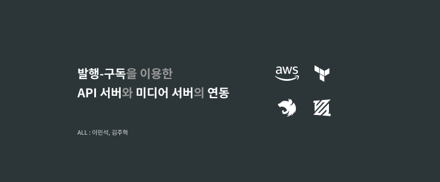
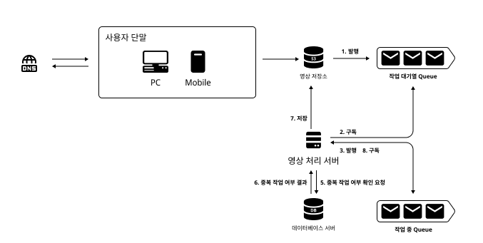

# 발행-구독을 이용한 API 서버와 미디어 처리 서버 연동



- [A. 개요](./README.md#a-개요)
    - [A.1. 인삿말 그리고 기여자](./README.md#a1-인삿말-그리고-기여자)
    - [A.2. 미디어 서버란 무엇인가?](./README.md#a2-미디어-서버란-무엇인가)
    - [A.3. 왜 EC2(ECS) 환경에 미디어 서버를 만드는가?](./README.md#a3-왜-ec2ecs-환경에-미디어-서버를-만드는가)
- [B. Get Started](./README.md#b-get-started)
    - [B.1. IAM 생성하기](./README.md#b1-iam-생성하기)
    - [B.2. S3, SQS 생성 및 연결하기](./README.md#b2-s3-sqs-생성-및-연결하기)
    - [B.3. 환경변수 파일(.env) 생성하기](./README.md#b3-환경변수-파일env-생성하기)
    - [B.4. FFmpeg 설치하기](./README.md#b4-ffmpeg-설치하기)
- [C. ETC](./README.md#c-etc)

## A. 개요

분산 서비스에서 **고가용성**, **고확장성**을 충족하는 미디어 서버를 구현하였습니다.

또한 중소기업 및 스타트업에서 사용 가능한 적정 수준의 기술을 사용하여 시스템 요구사항을 달성했습니다.

몇 가지 문제점에 대한 재해 복구(Failover) 및 예방 방법을 통해서 프로덕션 레벨에서 사용가능 함을 입증했습니다.

개략적으로 살펴보면 다음과 같은 주요 설계 포인트를 

- API 서버와 영상 처리 서버를 발행-구독 패턴으로 연결
- 영상 처리 서버가 주기적으로 구독을 할 수 있도록 크론 스케쥴러를 구성
- 스케쥴러의 최대 구독량을 제한하기 위해서 Semaphore로 실행 함수를 포장



### A.1. 인삿말 그리고 기여자

프로젝트 진행 간에 궁금한 부분은 [media server 이슈](https://github.com/unchaptered/media-server/issues)에 올려주시면 감사드리겠습니다.

| 이름  | GitHub           | LinkedIn |
| ----- | --------------- | --------- |
| 이민석 | [unchaptered](https://github.com/unchaptered) | [www.linkedin.com/in/minseok-lee](www.linkedin.com/in/minseok-lee) |
| 김주혁 | [playhuck](https://github.com/playhuck) | [www.linkedin.com/in/playhuck](www.linkedin.com/in/playhuck) |

### A.2. 미디어 서버란 무엇인가?

미디어 서버는 미디어 처리를 담당하는 서버입니다. <br>
미디어 처리란 이미지, 동영상 들을 가공하거나 활용한 작업을 포괄적으로 포함하였습니다.

미디어 처리는 CPU(GPU) 자원을 많이 요구할 뿐 아니라, 처리 시간도 API 서버 보다 수배~수십배 오래 걸리는 작업입니다. 따라서 API 서버와 분리하여 다음과 같은 형식으로 미디어 처리를 하게 됩니다.

1. Lambda : 저용량 이미지 파일의 가공 등이 가능
2. MediaConvert : 동영상 파일의 가동 등이 가능
3. EC2(ECS) + ? : 동영상 파일의 가공 등이 가능

### A.3. 왜 EC2(ECS) 환경에 미디어 서버를 만드는가?

MediaConvert와 같은 완전관리형 서비스의 경우 아무래도 비용이 비쌀 수밖에 없습니다. <br>
또한 서비스에 필요한 복잡하고 연속적인 영상처리 작업의 경우 지원하지 않을 확률이 높습니다.<br>
또한 AWS 종속성이 강해지기 때문에 이를 경계하는 개발자들도 많습니다.

따라서, 별도의 EC2(ECS) 환경에서 가동이 가능한 미디어 서버를 구축하게 됩니다.

따라서 이 프로젝트에서는 미디어 서버를 **잘 구현하는 방법**을 안내하고자 했습니다.

## B. Get Started

이 프로젝트를 가동하기 위해서 다음을 진행해주세요.

- ✔️ [IAM 생성하기](./README.md#b1-iam-생성하기)
- ✔️ [S3, SQS 생성 및 연결하기 : 튜토리얼 보기](./README.md#b2-s3-sqs-생성-및-연결하기)
- ✔️ [환경변수 파일(.env) 생성하기](./README.md#b3-환경변수-파일env-생성하기)
- ✔️ [FFmpeg 설치하기](./README.md#b4-ffmpeg-설치하기)

### B.1. IAM 생성하기

[AWS SDK 사용을 위한 IAM 가이드](https://unchaptered.notion.site/AWS-SDK-IAM-0ba94cf3c58f48a79eabe1bb878f49c5)를 참고해주세요.

### B.2. S3, SQS 생성 및 연결하기

[S3 + SQS를 이용한 이벤트 생성 가이드](https://unchaptered.notion.site/S3-SQS-f207c3dd737743bea25c41a473b376bc)를 참고해주세요.

### B.3. 환경변수 파일(.env) 생성하기

프로젝트 루트 경로에 다음의 파일을 생성해주세요.

```cmd
PORT = 3000

AWS_S3_REGION = S3 리전 명
AWS_S3_ACCESS_KEY = S3FullAccess 권한을 가진 IAM 공개키
AWS_S3_SECRET_KEY = S3FullAccess 권한을 가진 IAM 비밀키
AWS_S3_BUCKET_NAME = S3 버킷 명

AWS_SQS_REGION = SQS 리전 명
AWS_SQS_ACCESS_KEY = SQSFullAccess 권한을 가진 IAM 공개키
AWS_SQS_SECRET_KEY = SQSFullAccess 권한을 가진 IAM 비밀키
AWS_SQS_READY_QUEUE_URL = S3와 연동된 SQS URL
AWS_SQS_IN_PROCESSING_QUEUE_URL = S3와 연동되지 않은 SQS URL
```

### B.4. FFmpeg 설치하기

1. 사용자 환경의 OS에 맞는 FFmpeg 압축 파일을 다운로드 받아주세요.
2. 원하는 경로에 압축 파일을 풀되, 상위 폴더에 한글이 들어가지 않도록 해주세요.
3. 압축 파일을 풀고 나면 bin/ 폴더가 보이는데 ~bin/ 까지의 경로를 환경 변수에 등록해주세요.
4. VSC 혹은 cmd를 전부 종료하고 다시 키고 ffmpeg을 쳐서 설치를 확인해주세요.

- [GitHub FFmpeg@autobuild-2023-03-04-12-47](https://github.com/BtbN/FFmpeg-Builds/releases/tag/autobuild-2023-03-04-12-47)
- [윈도우 FFmpeg 설치 및 사용 방법 – gif 동영상 변환을 위해](https://happist.com/577463/%EC%9C%88%EB%8F%84%EC%9A%B0-ffmpeg-%EC%84%A4%EC%B9%98-%EB%B0%8F-%EC%82%AC%EC%9A%A9-%EB%B0%A9%EB%B2%95#hwangyeong_byeonsu_pyeonjib-eseo_saelo_mandeulgi)

### C. ETC

- [기여자](./CONTRIBUTING.md)
- [프로젝트 라이센스](./LICENSE)