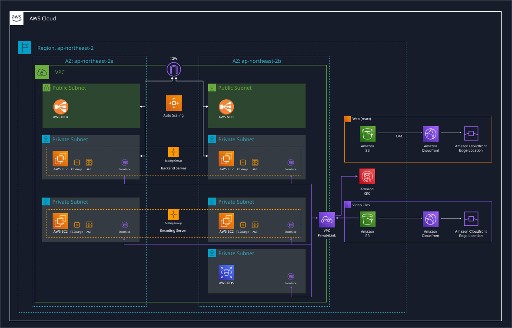
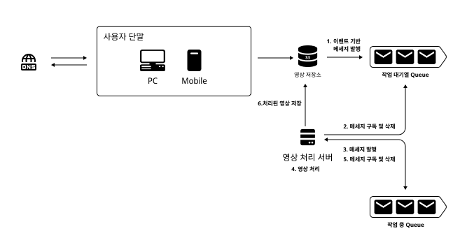
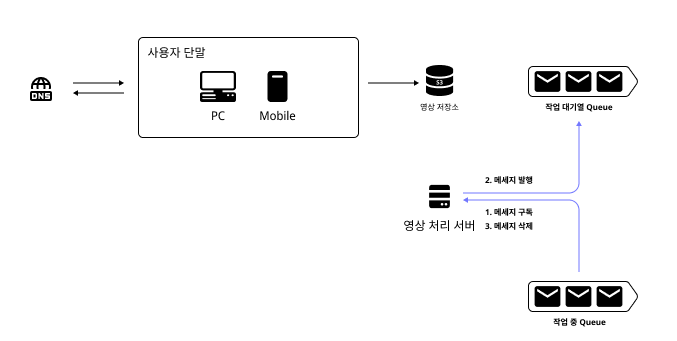
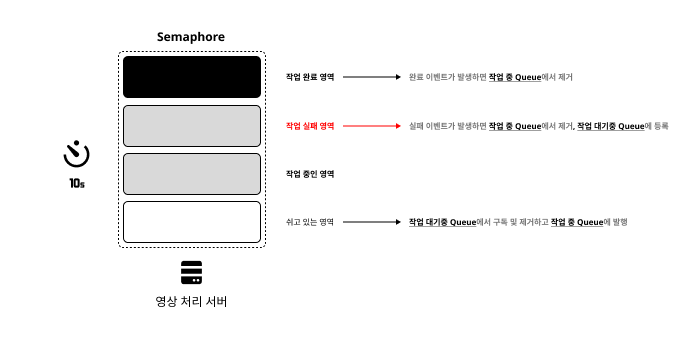

# 발행-구독을 이용한 API 서버와 미디어 처리 서버 연동


- [A. Get Started](./README.md#b-get-started)
- [B. 개요](./README.md#b-개요)
  - [B.1. 인삿말 그리고 기여자](./README.md#b1-인삿말-그리고-기여자)
  - [B.2. 기존 아키텍처](./README.md#b2-기존-아키텍처)
  - [B.3. 신규 아키텍처](./README.md#b3-신규-아키텍처)
  - [B.4. 개략적인 설계](./README.md#b4-개략적인-설계)
    - [B.4.1. 미디어 처리 로직](./README.md#b41-미디어-처리-로직)
    - [B.4.2. 미디어 처리 실패](./README.md#b42-미디어-처리-실패-처리-로직)
    - [B.4.3. 최대 미디어 처리량](./README.md#b43-최대-미디어-처리량-제한-로직)
  - [B.5. 결론, 가능성, 못한 부분](./README.md#b5-결론-가능성-못한-부분)
- [C. ETC](./README.md#c-etc)

## A. Get Started

프로젝트를 가동하기 위한 가이드 문서입니다. <br>
Windows 11 기준으로 작성되었습니다.

1. [Terraform 사용자 가이드](./docs/guide/terraform-guide.md)
2. [일반 사용자 가이드](./docs/guide/basic-guide.md)

위 가이드를 따라서 필수 설치항목을 따라해주세요.

```sh
npm run start:dev     # 서버가동

POST localhost:3000/video/pre-signed-url
PUT {{pre-signed-url}}
```

API 호출 방식을 사용하기 싫은 경우, S3 버킷에 직접 origin_파일명.mp4 형태로 동영상(.mp4)를 넣어주세요.

> 파일명이 달라서 발생하는 엣지케이스는 고려되지 않았습니다. <br>
> 호기심에 다른 형태의 파일명을 올리셨다면, S3 오브젝트와 SQS 메세지를 AWS Console을 통해서 제거하셔야 합니다.

## B. 개요

### B.1. 인삿말 그리고 기여자

프로젝트 진행 간에 궁금한 부분은 [media server 이슈](https://github.com/unchaptered/media-server/issues)에 올려주시면 감사드리겠습니다.

| 이름  | GitHub           | LinkedIn |
| ----- | --------------- | --------- |
| 이민석 | [unchaptered](https://github.com/unchaptered) | [https://www.linkedin.com/in/minseok-lee](https://www.linkedin.com/in/minseok-lee) |
| 김주혁 | [playhuck](https://github.com/playhuck) | [https://www.linkedin.com/in/playhuck](https://www.linkedin.com/in/playhuck) |


<br>

### B.2. 기존 아키텍처

일반적인 분산 서비스를 구현하였거나 구현할 능력이 있다고 가정하였습니다.

✔️ VPC 3-Tier Architecture 위에 설계 되었습니다. <br>
✔️ N개의 AZ 영역에 배포된 서비스는 ALB를 통해서 ASG로 배포됩니다. <br>
✔️ API 서버는 일반적인 사용자 요청만 처리하고 미디어 파일의 업로드는 [AWS S3 PreSignedURL](https://medium.com/@aidan.hallett/securing-aws-s3-uploads-using-presigned-urls-aa821c13ae8d)을 통해서 처리해서 API 서버 병목을 예방하고 있습니다. <br>
✔️ 모든 동영상 파일은 RDS에 기록되며, 미디어 처리 완료 여부가 기록되고 있습니다. 미디어 서버에서는 이를 전부 확인해서 최신순으로 처리하고 있습니다.

😂 일반적으로 미디어 서버는 CPU 자원을 임계 수치(70%) 까지 활용하도록 설계해야 합니다. 따라서 일반적인 스케일업 조건을 걸기 애매합니다.<br>
😂 기존의 구조는 동일한 파일이 여러번 분석될 가능성이 존재합니다. 이는 심각한 리소스 낭비로 아키텍처 수정을 통해 해결하고자 합니다. <br>
😂 팀에 DevOps가 따로 없기 떄문에 인프라 자원을 최소한으로 사용하여 `코드 레벨의 솔루션`을 구축하고자 합니다.



<br>

### B.3. 신규 아키텍처

미디어 처리 작업의 다음 특성을 고려해서 AWS SQS를 활용한 메세지 기반 서버로 변경하였습니다.

✔️ 미디어 처리의 완료 시간을 정확하기 에측하는 것은 어렵습니다. <br>
✔️ 미디어 처리는 제한된 CPU 자원으로 최적화된 동시 수량 N개 만큼만 가동해야 합니다. <br>
✔️ 미디어 처리량이 적거나 많을 경우 `스케일링`에 유연한 구조여야 합니다. <br>
✔️ 복수의 미디어 서버가 동일한 작업을 진행하는 `경쟁 조건`이 예방되어야 합니다. <br>
✔️ 미디어 처리 중 실패한 파일을 다시 분석하는 로직이 존재해야 합니다. <br>

### B.4. 개략적인 설계

#### B.4.1. 미디어 처리 로직

S3의 이벤트 알림을 통해서 SQS로 메세지를 발행합니다.

발행된 메세지는 작업 `대기열 Queue`에 발행됩니다.

각 미디어 서버는 5초 주기로 `작업 대기열 Queue`에서 1개의 메세지를 구독해 작업합니다.

각 작업 내역은 `작업 중 Queue`에 기록되며 미디어 처리에 실패하면 1개의 잔여 메세지가 작업 중 Queue에 남습니다. _[실패한 로직은 미디어 처리 실패 로직](./README.md#a41-미디어-처리-로직)에서 제어합니다._

미디어 처리에 실패하면 `작업 중 Queue`에 할당한 메세지를 제거하고 처리된 영상을 S3에 업로드합니다.



#### B.4.2. 미디어 처리 실패 처리 로직

미디어 처리에 실패할 경우, 1개의 잔여 메세지가 `작업 중 Queue`에 남습니다.

이 메세지는 7초 간격으로 조회하여 `작업 중 Queue`에 다시 발행하고 제거됩니다.



#### B.4.3. 최대 미디어 처리량 제한 로직

Cron과 Semaphore 라이브러리를 활용해서 5초에 한 번 작업자를 호출하고 최대 작업자는 2명인 구조로 만들었습니다. 최대 작업자를 변경하고 싶다면 [SemaphoreService.ts](./src/semaphore/semaphore.service.ts)의 생성자 안의 다음 숫자 2를 원하는 숫자 N으로 변경하면 됩니다.

```typescript
SemaphoreService.mainSemaphore = semaphore(2);
SemaphoreService.subSemaphore = semaphore(2);
```

Cron은 스케쥴러 라이브러리 중 하나로 **일정 시간마다 동일한 작업을 진행**합니다.

Semaphore는 **작업 최대량을 제한할 수 있는 손쉬운 기능을 제공하는 라이브러리**입니다.

매우 생소한 개념이라고 생각해서 Semaphore를 `작업자 집단`으로 부르고, 작업 최대량 만큼의 `작업자`가 집단에 존재한다고 생각하고 설명하겠습니다.

- 스케쥴러는 5초에 한 번 가동됩니다.
- 스케쥴러는 작업자 집단(Semaphore)이 하고 있는 일이 있는지 확인합니다.
  - 하고 있는 일이 있다면, 요청을 마무리합니다.
  - 하고 있는 일이 없다면, 요청을 전달하며 스케쥴러 함수는 종료합니다.
- 작업자 집단(Semaphore)은 개별 작업자에게 SQS에서 메세지를 구독해 작업을 진행할 것을 명령합니다.
  - 작업 대기중 Queue에 메세지가 없다면, 작업을 종료합니다.
  - 작업 대기중 Queue에 메세지가 있다면, 작업을 진행합니다.
  - 모든 결과가 끝나면, 작업자는 작업자 집단(Semaphore)의 작업 진행 수를 1 낮춰서 자신의 업무 종료를 알립니다.



### B.5. 결론, 가능성, 못한 부분

#### B.5.1. 결론

기존의 서비스 아키텍처를 개선하면서 인프라 자원을 최소한으로 활용하였습니다.<br>
_스테이지(local, dev...) 별 배포 자동화를 위한 Terraform은 선택 옵션입니다._

또한 주어진 요구사항을 위해 Cron, Semaphore, SQS를 적절히 활용하였습니다.

- Cron 스케쥴러, Semaphore를 통해서 최대 작업량을 제한한 점
- SQS를 최소한 활용하여 메세지를 발행하고 예외처리가 되어있는 점

배포 환경에서 수동으로 시간당 미디어 처리 최대치를 측정하면, semaphore(2)를 semaphore(n)으로 손쉽게 변경할 수 있습니다.

#### B.5.2. 가능성

SQS에 쌓인 메세지의 증감은 다음을 의미할 것입니다.

- 메세지의 증가 : 미디어 서버의 부하 : 서버 증설의 필요
- 메세지의 감소 : 미디어 서버의 낭비 : 서버 증감의 필요

이를 이용해서 SQS + ASG 스케일업 조건을 걸어서 확장성 있는 미디어 서버 구현이 가능합니다.

대다수의 미디어 처리는 GPU가 3~8배 이상이 빠르기 떄문에, 충분한 양의 AWS GPU Instance를 확보하면 매우 효율적으로 운영이 가능합니다.

#### B.5.3. 아쉬운 점

FFmpeg 테스트, Semaphore 테스트 등의 핵심 로직을 테스트했습니다.

하지만 Cron, Semaphore 내부의 비즈니스 로직 테스트를 하지 못했습니다.

이 부분이 아쉬웠고 개선된 테스트 코드로 비즈니스 로직의 안전성을 점검했으며 좋았을 것 같습니다.

추가적으로 Terraform 테스트, 인프라 종단 테스트 등도 하지 못해서 아쉬웠습니다.

<br>

### C. ETC

- [기여자](./CONTRIBUTING.md)
- [프로젝트 라이센스](./LICENSE)